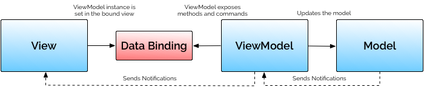

# MVVMArchitecture

[](http://developer.android.com/index.html)

My way to MVVM pattern using RxJava, LiveData, Room, Paging with the Android databinding
<br/>
<br/>

## What is MVVM pattern?
MVVM is an architectural pattern that was created to simplify user interface programming. 
Google appears to be encouraging the use of MVVM for data binding. 
In fact, the Architecture Components of its Data Binding Library are modeled on the MVVM pattern.


<br/>

## Samples
### Activity Layout File
```xml
    <data>
        <variable name="vm" type="com.leopold.mvvm.viewmodel.search.SearchViewModel"/>
    </data>
    
    <androidx.appcompat.widget.AppCompatImageButton
        android:id="@+id/search_button"
        android:layout_width="48dp"
        android:layout_height="48dp"
        android:src="@drawable/ic_search"
        android:background="?attr/selectableItemBackgroundBorderless"
        android:onClick="@{() -> vm.search()}"
        app:layout_constraintTop_toTopOf="parent"
        app:layout_constraintRight_toRightOf="parent"
        app:layout_constraintLeft_toRightOf="@+id/search_edit"/>
```

### Set Up the ViewModel
```Kotlin
    override fun onCreate(savedInstanceState: Bundle?) {
        super.onCreate(savedInstanceState)

        val binding = DataBindingUtil.setContentView<ActivitySearchBinding>(this, R.layout.activity_search)
        binding.vm = getViewModel()
        binding.setLifecycleOwner(this)
    }
```

### RecyclerView Adapter Item Layout File
```xml
    <data>
        <variable name="item" type="com.leopold.mvvm.data.remote.domain.Repository"/>
        <variable name="vm" type="com.leopold.mvvm.viewmodel.search.SearchViewModel"/>
    </data>
    
    <androidx.appcompat.widget.AppCompatTextView
        android:id="@+id/repository_item_name"
        android:layout_width="wrap_content"
        android:layout_height="wrap_content"
        android:layout_marginStart="6dp"
        android:text="@{item.name}"
        app:layout_constraintTop_toTopOf="parent"
        app:layout_constraintBottom_toBottomOf="parent"
        app:layout_constraintLeft_toLeftOf="parent"/>
```

### DataBinding in ViewHolder
```kotlin
    override fun onBindViewHolder(holder: RepositoryViewHolder, position: Int) {
        holder.binding.item = items[position]
        holder.binding.vm = vm
    }
    
    class RepositoryViewHolder(view: View) : RecyclerView.ViewHolder(view) {
        val binding: LayoutRepositoryItemBinding = LayoutRepositoryItemBinding.bind(view)
    }
```
<br/>

## Libraries

### Android Jetpack

* [DataBinding](https://developer.android.com/topic/libraries/data-binding/) Declaratively bind observable data to UI elements.

* [Lifecycle](https://developer.android.com/topic/libraries/architecture/lifecycle) Create a UI that automatically responds to lifecycle events.

* [LiveData](https://developer.android.com/topic/libraries/architecture/livedata) Build data objects that notify views when the underlying database changes.

* [ViewModel](https://developer.android.com/topic/libraries/architecture/viewmodel) Store UI-related data that isn't destroyed on app rotations. Easily schedule asynchronous tasks for optimal execution.

* [Room](https://developer.android.com/topic/libraries/architecture/room) Access your app's SQLite database with in-app objects and compile-time checks.

* [Paging](https://developer.android.com/topic/libraries/architecture/paging/) Makes it easier for you to load data gradually and gracefully within your app's RecyclerView.

### HTTP

* [Retrofit2](https://github.com/square/retrofit) Type-safe HTTP client for Android and Java by Square, Inc.

* [OkHttp](https://github.com/square/okhttp) An HTTP+HTTP/2 client for Android and Java applications.

### ReactiveX

* [RxJava2](https://github.com/ReactiveX/RxJava) A library for composing asynchronous and event-based programs using observable sequences for the Java VM

* [RxAndroid](https://github.com/ReactiveX/RxAndroid) RxJava bindings for Android

### DI

* [Koin](https://insert-koin.io/) A pragmatic lightweight dependency injection framework for Kotlin developers.
<br/>

## References

* [Understanding the basics of MVVM design pattern](https://blogs.msdn.microsoft.com/msgulfcommunity/2013/03/13/understanding-the-basics-of-mvvm-design-pattern/)
* [Data Binding Library](https://developer.android.com/topic/libraries/data-binding/)
<br/>

License
-------

    Copyright 2018 Leopold Baik

    Licensed under the Apache License, Version 2.0 (the "License");
    you may not use this file except in compliance with the License.
    You may obtain a copy of the License at

       http://www.apache.org/licenses/LICENSE-2.0

    Unless required by applicable law or agreed to in writing, software
    distributed under the License is distributed on an "AS IS" BASIS,
    WITHOUT WARRANTIES OR CONDITIONS OF ANY KIND, either express or implied.
    See the License for the specific language governing permissions and
    limitations under the License.
